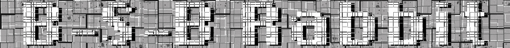

<!-- PROJECT SHIELDS -->
[![Contributors][contributors-shield]][contributors-url]
[![Forks][forks-shield]][forks-url]
[![Stargazers][stars-shield]][stars-url]

<!-- PROJECT LOGO -->
 

  

<h2 align="center">Calculator. Pet-project</h3>

  

    This is my first pet project in which I put into practice the skills of adaptive layout and the use of Javascript and other components.
  

<!-- TABLE OF CONTENTS -->

  
Table of Contents

  <ol>
    <li>
      <a href="#about-the-project">About The Project</a>
      <ul>
        <li><a href="#built-with">Built With</a></li>
      </ul>
    </li>
    <li><a href="#usage">Usage</a></li>
    <li><a href="#Development">Development</a></li>
  </ol>

<!-- ABOUT THE PROJECT -->
## About The Project

[![Product Name Screen Shot][product-screenshot]](https://b-s-b-rabbit.github.io/dist/index.html)

This project was developed by me alone and is more of a learning project, but you can still use its capabilities when calculating various expressions. The project consists of 3 pages: the calculator itself, a page about its use and my, in a sense, summary page, where there is information about me, this project and some links.
The logic of the calculator itself is implemented using the shunting yard algorithm and reverse Polish notation. The code is documented according to the JSDoc standard (as far as I had enough time to figure it out), as well as the main algorithm was tested using the JS framework Jest. About all the technologies below

(<a href="#readme-top">back to top</a>)

### Built With

* 
* 
* 
* 
* 
* 
* 

(<a href="#readme-top">back to top</a>)

<!-- USAGE EXAMPLES -->
## Usage

Use this project directly in your browser: https://b-s-b-rabbit.github.io/dist/index.html

(<a href="#readme-top">back to top</a>)

<!-- Development -->
## Development
The development process has reached its beta version on 27.10.23. Now the calculator is ready for use, however, before the full release, you may need to change the functionality or make additional edits, which I will do when it is convenient for me.
During development, I studied and refreshed the various features of HTML, CSS and Javascript.
Firstly, it was decided to write code directly in SCSS, since this provides more convenience in writing code related to well-implemented nesting, mixins, variables, and so on. In the development of the application itself, an adaptive CSS layout of the mobile-first type was used using Flexbox, Grid and adaptive text (perhaps some changes are waiting for him). A lot of elements are stylized to look normal (as far as it seems normal to me, as not a designer). In HTML5 terms, semantic layout was used both at the block level and at the text level. And seasoned with SEO optimization, but quite a bit.
It was decided to use two main methodologies - BEM as a methodology for naming HTML classes and using them, 7-in-1 as a methodology for structuring SCSS files.
Linters and formatters were used to maintain a uniform code style and follow certain standards.
For linting and formatting Javascript code, Eslint was used in combination with Prettier(https://github.com/wesbos/eslint-config-wesbos ).
Stylelint with extensions in scss and idiomatic order was used to lint the SCSS code.
This allowed us to maintain a single standard for the code and increase readability and further team development (conditionally).
Finally, the Javascript files were divided into modules and the webpack assembler was used in configuration with babel, terser-webpack-plugin for code minification and html-webpack-plugin for creating ready-made html templates with integrated js code after assembly.
Documenting the code according to the JSDoc standard creates a convenient opportunity to change the code base, providing the necessary information about implemented functions, objects, etc.
Finally, the critical functionality of the calculator site (namely, its internal implementation) was tested using the Jest framework.
In the future, I hope to improve this project in order to bring it to the release version, but time does not stand still, and more intensive classes take up the time that I can spend on this project. See you soon!

(<a href="#readme-top">back to top</a>)

<!-- MARKDOWN LINKS & IMAGES -->
<!-- https://www.markdownguide.org/basic-syntax/#reference-style-links -->
[contributors-shield]: https://img.shields.io/github/contributors/B-S-B-Rabbit/B-S-B-Rabbit.github.io.svg?style=for-the-badge
[contributors-url]: https://github.com/B-S-B-Rabbit/B-S-B-Rabbit.github.io/graphs/contributors
[forks-shield]: https://img.shields.io/github/forks/B-S-B-Rabbit/B-S-B-Rabbit.github.io.svg?style=for-the-badge
[forks-url]: https://github.com/B-S-B-Rabbit/B-S-B-Rabbit.github.io/network/members
[stars-shield]: https://img.shields.io/github/stars/B-S-B-Rabbit/B-S-B-Rabbit.github.io.svg?style=for-the-badge
[stars-url]: https://github.com/B-S-B-Rabbit/B-S-B-Rabbit.github.io/stargazers
[product-screenshot]: ./images/screen.jpg